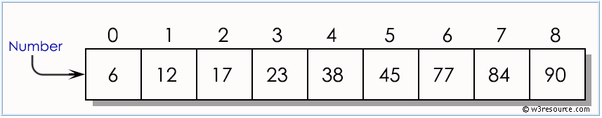
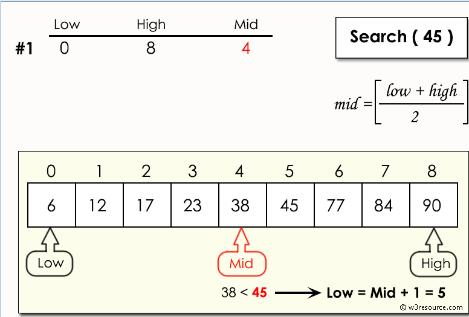
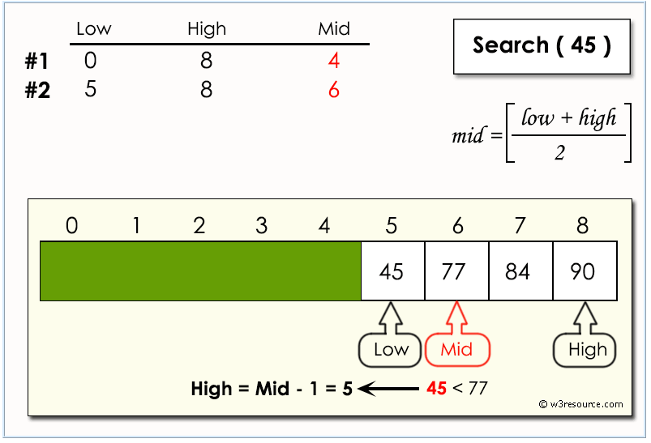
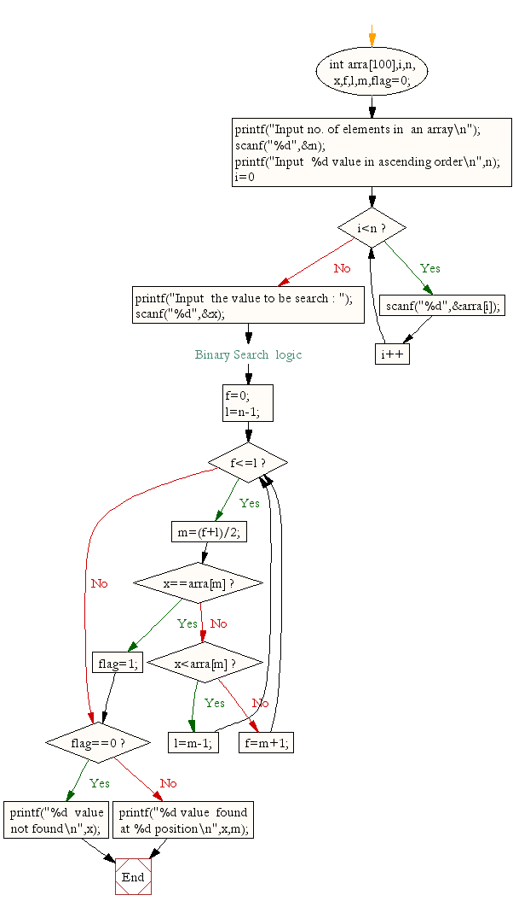

# Ejercicio 10-1

## Enunciado

Escribir un programa para encontrar la posición de un valor determinado dentro de un array ordenado usando búsqueda binaria.
Búsquda Binaria: 
En informática, un algoritmo de búsqueda binaria o de medio intervalo encuentra la posición de un valor objetivo dentro de una matriz ordenada. 
El algoritmo de búsqueda binaria puede clasificarse como un algoritmo de búsqueda de división y conquista de dicotomías y se ejecuta en tiempo logarítmico.

## Representación
Dada una matriz ordenada arra[] de n elementos, escriba una función para buscar un elemento dado x en arra[].

## Diagrama de Flujo

