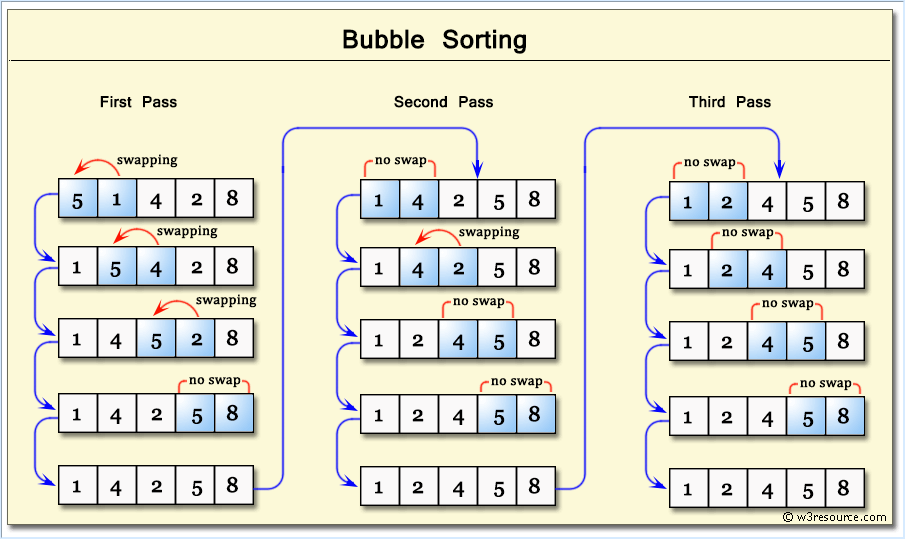
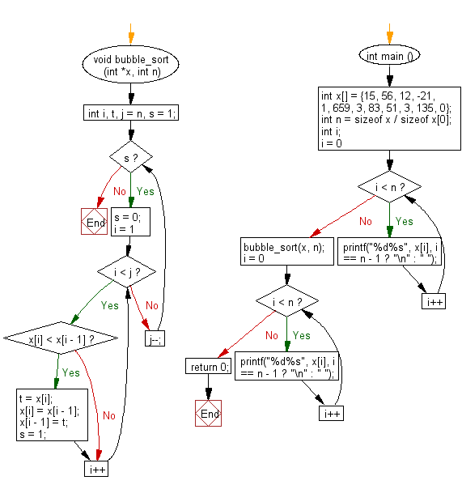

# Ejercicio 10-1

## Enunciado

Escribir un programa en C para ordenar una lista de elementos utilizando el algoritmo de ordenación por burbujas.
Nota: La ordenación por burbujas funciona intercambiando repetidamente los elementos adyacentes si están en un orden incorrecto.

## Representación

## Diagrama de Flujo

