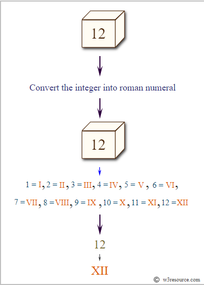
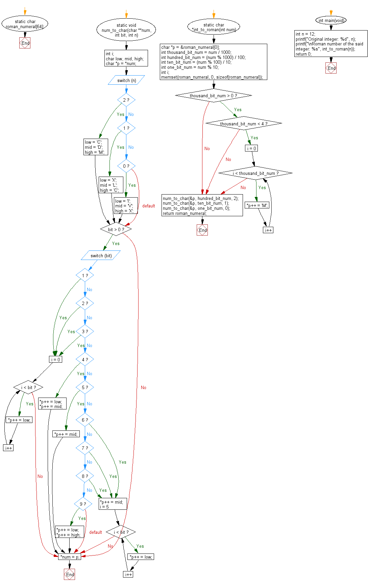

# Ejercicio 100-2

## Enunciado

Escribir un programa que convierta un número entero dado a número romano

| Símbolo  | Valor |
|----------|-------|
| I        |  1    |  
| V        |  5    |
| X        |  10   |
| L        |  50   |
| C        |  100  |
| D        |  500  |
| M        |  1000 |

## Representación

## Diagrama de Flujo

