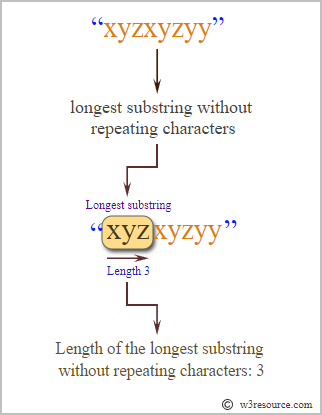
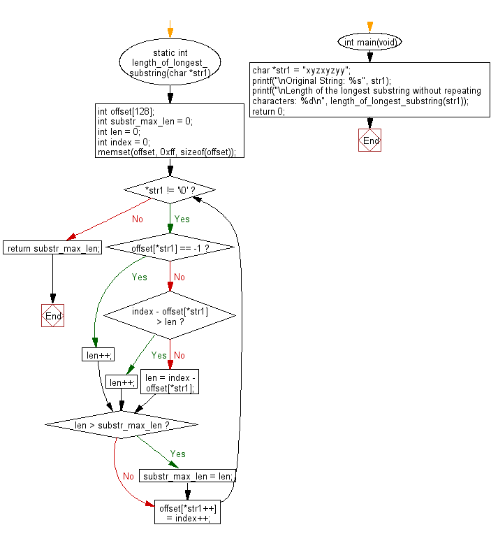

# Ejercicio 100-4

## Enunciado

Encontrar el substring sin caracteres repetidos más largo, de un string dado.
Escribir un programa en C que indique la longitud del substring indicado.

Casos de ejemplo:

    Input String : xyzxyzyy
    Longitud del substring más largo : 3
    Substring más largo : xyz

    Input String : pickoutthelongestsubstring
    Longitud del substring más largo : 8
    Substring más largo : ubstring

## Representación

## Diagrama de Flujo

