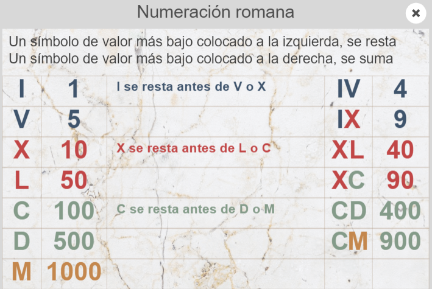
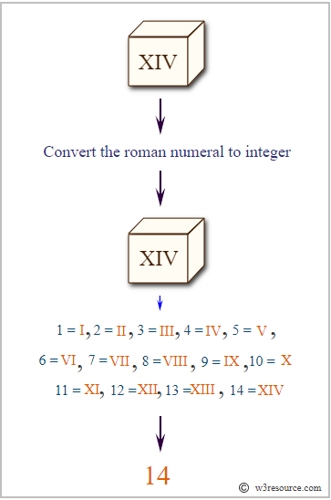
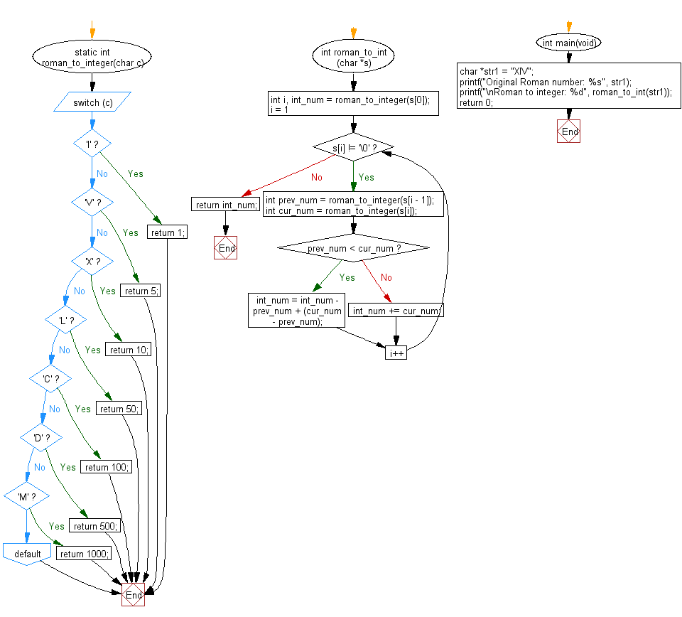

# Ejercicio 100-2

## Enunciado

Escribir un programa que convierta un número romano dado a número entero

| Valor | Símbolo  |
|-------|----------|
|  1    | I        |
|  5    | V        |
|  10   | X        |
|  50   | L        |
|  100  | C        |
|  500  | D        |
|  1000 | M        |

## Representación

## Diagrama de Flujo

## Referencias

[Generador de Numeros Romanos](https://capitalizemytitle.com/generador-de-numeros-romanos)
