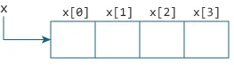

# Relación entre matrices y punteros

## Lenguajes Estructurados

---

Una matriz es un bloque de datos secuenciales. Vamos a escribir un programa para imprimir direcciones de elementos de matriz.

```c
#include <stdio.h>
int main() {
   int x[4];
   int i;

   for(i = 0; i < 4; ++i) {
      printf("&x[%d] = %p\n", i, &x[i]);
   }

   printf("Direccion del array x: %p", x);

   return 0;
}
```

---

**Salida**

&x[0] = 1450734448
&x[1] = 1450734452
&x[2] = 1450734456
&x[3] = 1450734460
Direccion del array x: 1450734448

Hay una diferencia de 4 bytes entre dos elementos consecutivos de la matriz `x`. Es porque el tamaño de `int` es de 4 bytes (en nuestro compilador).

Por lo tanto, la dirección de `x[1]` es `4` bytes más que la dirección de `x[0]`. De manera similar, la dirección de `x[2]` es `4` bytes más que la dirección de `x[1]` y así sucesivamente.

Tener en cuenta que, la dirección de `&x[0]` y `x` es lo mismo. Es porque el nombre de la variable apunta al primer elemento de la matriz.

---



Del ejemplo anterior, queda claro que `&x[0]` es equivalente a `x`. Y, `x[0]` es equivalente a `*x`.

Semejantemente

- `&x[1]` es equivalente a `x+1` y `x[1]` es equivalente a `*(x+1)`
- `&x[2]` es equivalente a `x+2` y `x[2]` es equivalente a `*(x+2)`
- ...
- Básicamente, `&x[i]` es equivalente a `x+i` y `x[i]` es equivalente a `*(x+i)`.

---

### Ejemplo 1: Punteros y matrices

```c
#include <stdio.h>
int main() {

  int i, x[6], sum = 0;

  printf("Enter 6 numbers: ");

  for(i = 0; i < 6; ++i) {
  // Equivalente a scanf("%d", &x[i]);
      scanf("%d", x+i);

  // Equivalente a sum += x[i]
      sum += *(x+i);
  }

  printf("Sum = %d", sum);

  return 0;
}
```

---

Cuando ejecute el programa, el resultado será:

Enter 6 numbers: 2

3
4
4
12
4
Sum = 29

Aquí, hemos declarado una matriz `x` de 6 elementos. Para acceder a los elementos de la matriz, hemos utilizado punteros.

---

En la mayoría de los contextos, los nombres de matriz se descomponen en punteros.

En palabras simples, los nombres de matriz se convierten en punteros.

Esa es la razón por la que puede usar punteros para acceder a elementos de matrices.

Sin embargo, debe recordar que los punteros y las matrices no son lo mismo.

---

### Ejemplo 2: Matrices y punteros

```c
#include <stdio.h>
int main() {

  int x[5] = {1, 2, 3, 4, 5};
  int* ptr;

  // a ptr se le asigna la dirección del tercer elemento
  ptr = &x[2]; 

  printf("*ptr = %d \n", *ptr);           // 3
  printf("*(ptr+1) = %d \n", *(ptr+1));   // 4
  printf("*(ptr-1) = %d", *(ptr-1));      // 2

  return 0;
}
```

---

Cuando ejecute el programa, el resultado será:

*ptr = 3
*(ptr+1) = 4
*(ptr-1) = 2

En este ejemplo, `&x[2]`, la dirección del tercer elemento se asigna al puntero `ptr`. Por lo tanto,`3` se mostró cuando imprimimos `*ptr`.

La impresión de `*(ptr+1)` nos da el cuarto elemento. Del mismo modo, la impresión de `*(ptr-1)` nos da el segundo elemento.
