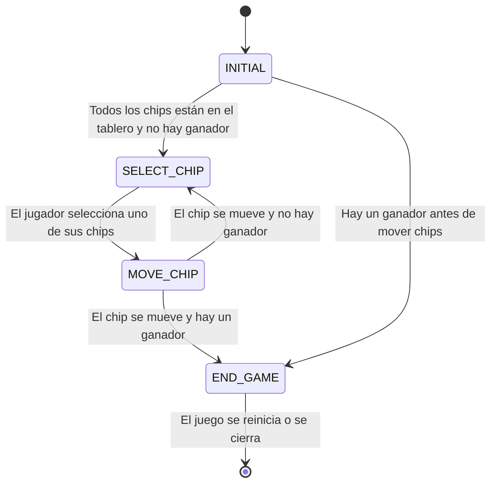

# 03.05.02 -  TicTacToe - Estados

## Lenguajes Estructurados

---

**Estado `INITIAL`**: En este estado, los jugadores están colocando sus fichas en el tablero.
    - Asumamos que las fichas son colocadas alternativamente por cada jugador.
    - Necesitamos seguir el turno del jugador y permitirles seleccionar una celda vacía para colocar su ficha.
    - Después de cada movimiento, verificamos si el tablero tiene algún ganador.
    - Si un jugador gana, pasamos al estado `END_GAME`.
    - Si todos las fichas han sido colocadas y no hay ganador, pasamos al estado`SELECT_CHIP`.

---

**Estado `SELECT_CHIP`**: En este estado, el jugador cuyo turno es, seleccionaría una de sus fichas existentes para moverla. 
    - Si el jugador selecciona una de sus fichas (haciendo clic en una de sus fichas), entonces guardamos esa ficha como la ficha seleccionada y pasarías al estado `MOVE_CHIP`.

---

**Estado `MOVE_CHIP`**: En este estado, el jugador debería seleccionar una celda adyacente vacía a la celda de la ficha seleccionada para mover la ficha.
    - Si el jugador selecciona una celda adyacente vacía, movemos la ficha seleccionada a la nueva celda y verificamos nuevamente si hay algún ganador.
     - Si un jugador gana, pasamos al estado `END_GAME`.
     - Si ninguno de estos casos se cumple, cambiamos el turno al otro jugador y volvemos al estado `SELECT_CHIP`.

---

**Estado `END_GAME`**: En este estado, el juego ha terminado.
    - Mostramos un mensaje indicando quién ha ganado o si el juego ha terminado en empate.
    - También podemos proporcionar una opción para reiniciar el juego.
  
---

