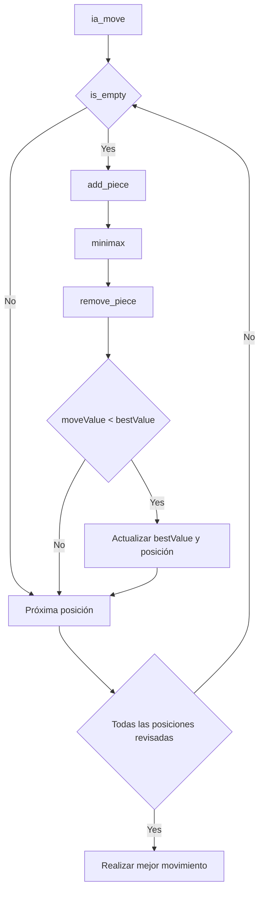
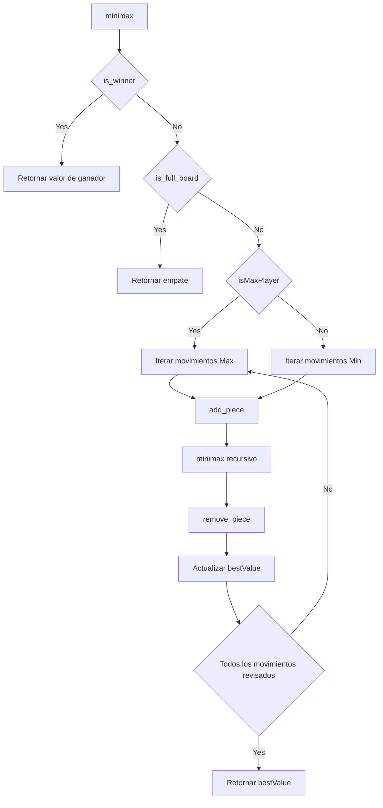
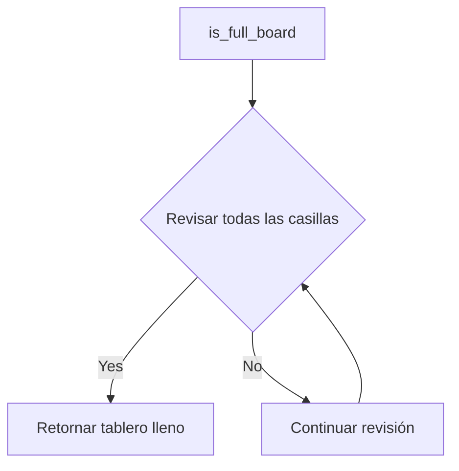

## Diagramas de flujo

### Diagrama de flujo de la función `ia_move`

---

### Diagrama de flujo de la función `minimax`

---
### Diagrama de flujo de la función `is_winner`

---

### Diagrama de flujo de la función `is_full_board`

---
### Diagrama de flujo de la función `is_empty`

---

### Diagrama de flujo de la función `remove_piece`

---

