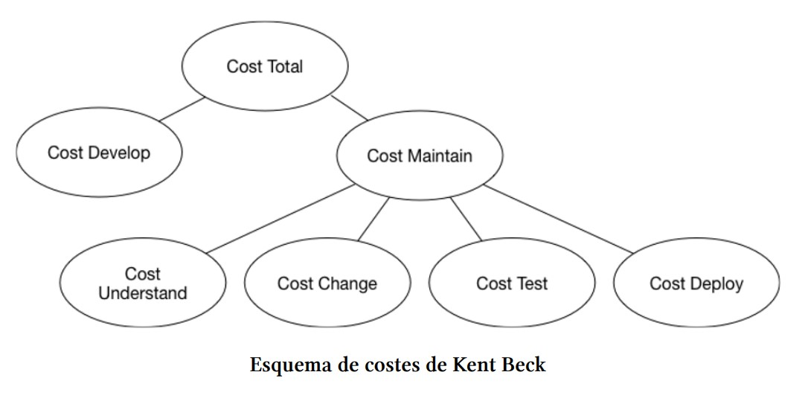

# 01.02 - Buenas prácticas

## Lenguajes Estructurados

---

- El costo total de un producto software está dado por la suma de los costos de desarrollo y de mantenimiento, siendo este último mucho más elevado que el coste del propio desarrollo inicial.
- A su vez el costo de mantenimiento viene dado por la suma de los costos:
  
  - entender el código existente
  - cambiarlo
  - testearlo
  - desplegarlo en producción

---



---

## Código limpio

- El código limpio es aquel que se puede leer y entender fácilmente, y que se puede modificar fácilmente sin introducir errores.
- Tratar de entender el código de un tercero, o incluso el que escribimos nosotros mismos hace apenas unas semanas, se puede volver una tarea realmente difícil. 
- Es por eso que hacer un esfuerzo extra para que nuestra solución sea legible e intuitiva es la base para reducir los costos de mantenimiento del software que producimos.

---

## Variables y Nombres

- Nuestro código debería poder leerse con la misma facilidad con la que se lee un texto bien escrito, por eso es fundamental  elegir buenos nombres.
- Los nombres de variables, métodos y clases deben seleccionarse con cuidado para que den **expresividad y significado** a nuestro código.

---

## Nombres pronunciables y expresivos

- Los nombres deben ser pronunciables, es decir, que no contengan caracteres especiales ni abreviaturas.
- Intentar no ahorrar caracteres en los nombres, la idea es que sean lo más expresivos posible.

```c
// mal
int d; // días transcurridos desde la fecha de inicio

// bien
int diasTranscurridos;
```

---

## Ausencia de información técnica en los nombres

- Evitar incluir información técnica en los nombres, ya que puede hacer que el código sea más difícil de entender. Es decir, evitar incluir información relacionada con la tecnología, como el tipo de dato o la notación húngara, el tipo de clase, etc.

```c
// mal
struct AbstractUser { ... };


// bien
struct User { ... };
```

---

## Léxico coherente

- Se debe usar el mismo vocabulario para hacer referencia al mismo concepto, no se debería usar por ejemplo en algunos lados User, en otro Client y en otro Customer, a no ser que representen claramente conceptos diferentes.
  
```c
// mal
getUserInfo();
getClientData();
getCustomerRecord();

// bien
getUser();
```

---

## Nombres según el tipo de dato

- Los arrays son una lista iterable de elementos, generalmente del mismo tipo. Es por eso que pluralizar el nombre de la variable puede ser una buena idea

```c
// mal
const fuit = ['apple', 'banana', 'orange'];

// regular
const fruit_list = ['apple', 'banana', 'orange'];

// bien
const fruits = ['apple', 'banana', 'orange'];

// mejor
const fruit_names = ['apple', 'banana', 'orange'];
```

---

## Booleanos

- Los booleanos solo pueden tener 2 valores: verdadero o falso. El uso de prefijos como *is, has* y *can* ayudará inferir el tipo de variable, mejorando así la legibilidad de nuestro código.

```c
// mal
const open = true;
const write = true;
const fruit = true;

// bien
const isOpen = true;
const canWrite = true;
const hasFruit = true;
```

---

## Números

- Para los números es interesante elegir prefijos que describan características numéricas de la variable, como min, max o total.

```c
// mal
const fruits = 5;

// bien
const maxFruits = 8;
const minFruits = 1;
const totalFruits = 2;
```

---

## Funciones

- Los nombres de las funciones deben representar acciones, por lo que deben construirse usando el verbo que representa la acción, seguido de un sustantivo. Estos deben de ser descriptivos y a la vez concisos. Esto quiere decir que el nombre de la función debe expresar lo que hace, pero también debe de abstraerse de la implementación de la función.

```c
// mal
createUserIfNotExists();
updateUserIfNotEmpty();
sendEmailIfFieldIsNotEmpty();

// bien
createUser();
updateUser();
sendEmail();
```

---

En el caso de las funciones de acceso, modificación o predicado, el nombre debe ser el prefijo get, set e is, respectivamente.

```c
getUser();
setUser(...);
isValidUser();

```

---

## Tamaño y función

- La simplicidad es fundamental a la hora de escribir buen código, es por eso que la primera recomendación es que nuestras funciones deben de tener un tamaño reducido.
- Normalmente de suele escribir funciones de 4 o 5 líneas, en algunas ocasiones pueden llegar a 15 o 20 líneas. Casi nunca deben exceder esa cantidad salvo que nos encontremos con una acción que no pueda ser dividida.
- Si las funciones de un código tienen un tamaño demasiado grande, es probable que hagan demasiadas cosas. Esto nos lleva a la segunda recomendación y quizás la más importante: **las funciones deben hacer una única cosa** y hacerla bien.

---

## Número de argumentos

- Limitar el número de argumentos que recibe una función.
En general deberíamos limitarnos a tres parámetros como máximo. Si una función recibe más de tres argumentos, es probable que estemos haciendo algo mal.

- En el caso de tener que exceder este número, podría ser una buena idea añadir un nivel más de indirección a través de una estructura.

---

## Principio DRY

- Teniendo en cuenta que la duplicación de código suele ser la raíz de múltiples problemas, una buena práctica es la implementación del principio DRY (don’t repeat yourself).
- Este principio, que en español significa no repetirse, nos evitará múltiples problemas como tener que testear lo mismo varias veces, además de ayudarnos a reducir la cantidad de código a mantener.
- Para eso lo ideal sería extraer el código duplicado a una función y utilizarlo donde nos haga falta. Muchas veces esta duplicidad no será tan evidente y será nuestra experiencia la que nos ayude a detectarla, y refactorizar el código cada vez que se detecten estas situaciones.

---

## Evitar el uso de comentarios

- Los comentarios son una herramienta que nos permite documentar nuestro código, pero también pueden ser una fuente de problemas.
- Cuando se necesita añadir comentarios al código es porque éste no es lo suficientemente autoexplicativo, lo cual quiere decir que no se están eligiendo buenos nombres.
- Cuando surja la necesidad de escribir un comentario, antes hay que tratar de refactorizar el código y/o nombrar los elementos del mismo de otra manera.
- Lo importante es **comentar el `por qué`, más que comentar el `qué` o el `cómo`**. Ya que el `cómo` lo vemos, es el código; y el `qué` no debería ser necesario si se escribe código autoexplicativo.
- Pero el `por qué` se decidió resolver algo de cierta manera sabiendo de que resulta extraño, eso sí debería ser explicado.
