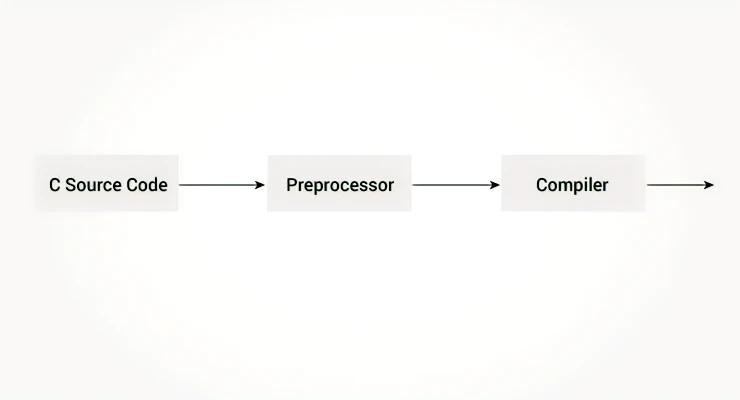

# 02.00 - Preprocesador y Macros

## Lenguajes Estructurados

---

### Funcionamiento del preprocesador C



El preprocesador C es un preprocesador de macros (permite definir macros) que transforma el programa antes de compilarlo. Estas transformaciones pueden ser la inclusión de archivos de cabecera, expansiones de macros, etc.

---

Todas las directivas de preprocesamiento comienzan con un símbolo `#`. Por ejemplo

```c
#define PI 3.14
```

Algunos de los usos comunes de los preprocesadores C son:

### Incluir archivos de cabecera #include

El preprocesador `#include` se utiliza para incluir archivos de cabecera en programas C. Por ejemplo

```c
#include <stdio.h>
```

---

Aquí, `stdio.h` es un archivo de encabezado. La directiva de preprocesador `#include` reemplaza la línea anterior con el contenido del archivo de cabecera `stdio.h`.

Esa es la razón por la que necesita usar `#include <stdio.h>` antes de poder usar funciones como `scanf()` y `printf()`.

También puede crear su propio archivo de encabezado que contenga la declaración de función e incluirlo en su programa utilizando esta directiva de preprocesador.

```c
#include "my_header.h"
```

---

## Macros con #define

Una macro es un fragmento de código al que se le asigna un nombre. Puede definir una macro en C utilizando la directiva de preprocesador `#define`.

Aquí hay un ejemplo.

```c
#define c 299792458  // speed of light
```

Aquí, cuando usamos `c` en nuestro programa, se reemplaza con `299792458`.

---

### Ejemplo 1: #define preprocesador

```c
#include <stdio.h>
#define PI 3.1415

int main()
{
    float radius, area;
    printf("Enter the radius: ");
    scanf("%f", &radius);

    // Notar el uso de PI
    area = PI*radius*radius;

    printf("Area=%.2f",area);
    return 0;
}
```

---

## Macros como funciones

También puede definir macros que funcionen de manera similar a una llamada a función. Esto se conoce como macros similares a funciones. Por ejemplo

```c
#define circleArea(r) (3.1415*(r)*(r))
```

Cada vez que el programa encuentra `circleArea(argument)`, se reemplaza por `(3.1415*(argument)*(argument))`.

Supongamos que pasamos 5 como argumento entonces, se expande de la siguiente manera:

```c
circleArea(5) expands to (3.1415*5*5)
```

---

### Ejemplo 2: Uso de #define

```c
#include <stdio.h>
#define PI 3.1415
#define circleArea(r) (PI*r*r)

int main() {
    float radius, area;

    printf("Enter the radius: ");
    scanf("%f", &radius);
    area = circleArea(radius);
    printf("Area = %.2f", area);

    return 0;
}
```

---

## Compilación condicional

En la programación en C, puede indicar al preprocesador si debe incluir un bloque de código o no. Para ello, se pueden utilizar directivas condicionales.

Es similar a una declaración `if` con una diferencia importante.

La instrucción `if` se prueba durante el tiempo de ejecución para comprobar si un bloque de código debe ejecutarse o no, mientras que los condicionales se utilizan para incluir (u omitir) un bloque de código en el programa antes de la ejecución.

---

### Usos del condicional

- Utilice código diferente dependiendo de la máquina, sistema operativo
- Compilar el mismo archivo fuente en dos programas diferentes
- para excluir cierto código del programa, pero para mantenerlo como referencia para fines futuros

### ¿Cómo usar condicional?

Para usar condicional se utilizan directivas `#ifdef`,`#if`,`#defined`,`#else` y `#elif`

---

### Directiva #ifdef

```c
#ifdef MACRO     
   // codigo condicional
#endif
```

Aquí, los códigos condicionales se incluyen en el programa solo si `MACRO` está definido.

### Directiva #if, #elif y #else

```c
#if expression
   // codigo condicional
#endif
```

Aquí, `expression` es una expresión de tipo entero (pueden ser enteros, caracteres, expresión aritmética, macros, etc.).

Los códigos condicionales se incluyen en el programa sólo si `expression` se evalúa a un valor distinto de cero.

---

La directiva opcional `#else` se puede utilizar con la directiva`#if`.

```c
#if expression
   // codigo condicional si expression es distinto de cero
#else
    // codigo condicional si expression es cero
#endif
```

También puede agregar condicional anidado al `#if...#else` usando `#elif`

```c
#if expression
   // codigo condicional si expression es distinto de cero    
#elif expression1
   // codigo condicional si expression1 es distinto de cero
#elif expression2
   // codigo condicional si expression2 es distinto de cero
#else
    // codigo condicional si todas las expresiones son cero
#endif
```

---

### #defined

El operador especial `#defined` se utiliza para probar si una determinada macro está definida o no. A menudo se usa con la directiva `#if`.

```c
#if defined BUFFER_SIZE && BUFFER_SIZE >= 2048
  // codes
```

---

## Macros predefinidas

Aquí hay algunas macros predefinidas en la programación C.

| Macro | Valor |
| --- | --- |
| `__DATE__` | Una cadena que contiene la fecha actual. |
| `__FILE__` | Una cadena que contiene el nombre de archivo. |
| `__LINE__` | Un entero que representa el número de línea actual. |
| `__STDC__` | Si sigue el estándar ANSI C, entonces el valor es un entero distinto de cero. |
| `__TIME__` | Una cadena que contiene la hora actual. |

---

### Ejemplo 3: Obtener la hora actual usando \_\_TIME\_\_

El siguiente programa genera la hora actual mediante macro `__TIME__`.

```c
#include <stdio.h>
int main()
{
   printf("Current time: %s",__TIME__);   
}
```

**Salida**

```c
Current time: 19:54:39
```

---

### Lecturas recomendadas

- [Control de línea](https://gcc.gnu.org/onlinedocs/cpp/Line-Control.html#Line-Control)
- [Pragmas](https://gcc.gnu.org/onlinedocs/cpp/Pragmas.html#Pragmas)
- [Salida del preprocesador](https://gcc.gnu.org/onlinedocs/cpp/Preprocessor-Output.html#Preprocessor-Output)
- [Otras directivas](https://gcc.gnu.org/onlinedocs/cpp/Other-Directives.html#Other-Directives)
- [macros y #define preprocesador](https://gcc.gnu.org/onlinedocs/cpp/Macros.html#Macros "C Macros")
- [Uso de archivos de encabezado](https://gcc.gnu.org/onlinedocs/cpp/Header-Files.html#Header-Files "Include preprocessor")
