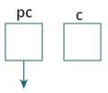
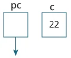
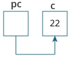
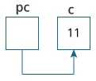
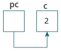

# Punteros en C

## Lenguajes Estructurados

---

Contenido:

- qué son los punteros
- cómo se los usa
- errores comunes al trabajar con ellos con la ayuda de ejemplos

---

## Dirección en C

Si tenemos una variable `var` en un programa, `&var` nos dará su dirección asignada en la memoria.

Hemos usado la dirección en numerosas ocasiones mientras usábamos la función.`scanf()`

```c
scanf("%d", &var);
```

Aquí, el valor introducido por el usuario se almacena en la dirección de la variable. Tomemos un ejemplo práctico con el uso de `var`

---

```c
#include <stdio.h>
int main()
{
  int var = 5;
  printf("var: %d\n", var);

  // Observar el uso de & antes de var
  printf("direccion de var: %p", &var);
  return 0;
}
```

**Salida**
var: 5
direccion de var: 2686778

**Nota:** Probablemente se obtendrá una dirección diferente cuando ejecute el código anterior.

---

## Punteros en C

Los punteros (variables de puntero) son variables especiales que se utilizan para almacenar direcciones en lugar de valores.

### Sintaxis del puntero

Así es como podemos declarar punteros.

```c
int* p;
```

Aquí, hemos declarado un puntero `p` de tipo `int`

También puede declarar punteros de estas maneras.

```c
int *p1;
int * p2;
```

---

Tomemos otro ejemplo de declaración de punteros.

```c
int* p1, p2;
```

Aquí, hemos declarado un puntero `p1` y una variable normal `p2`

### Asignación de direcciones a punteros

Tomemos un ejemplo.

```c
int* pc, c;
c = 5;
pc = &c;
```

Aquí, 5 se asigna a la variable `c`. Y, la dirección de `c` se asigna al puntero `pc`

---

### Obtener valor de la cosa señalada por punteros

Para obtener el valor de la cosa apuntada por los punteros, usamos el operador `*`. Por ejemplo:

```c
int* pc, c;
c = 5;
pc = &c;
printf("%d", *pc);   // Output: 5
```

Aquí, la dirección de `c` se asigna al puntero `pc`. Para obtener el valor almacenado en esa dirección, usamos `*pc`

> **Nota:** En el ejemplo anterior, `pc` es un puntero, no `*pc` . No puedes y no debes hacer algo como `*pc = &c`;
> Por cierto, `*` se llama operador de dereferenciación o indirección (cuando se trabaja con punteros). Opera en un puntero y da el valor almacenado en ese puntero.

---

### Cambio del valor señalado por punteros

Tomemos un ejemplo.

```c
int* pc, c;
c = 5;
pc = &c;
c = 1;
printf("%d", c);    // Output: 1
printf("%d", *pc);  // Ouptut: 1
```

Hemos asignado la dirección de `c` al puntero `pc`

Luego, cambiamos el valor de `c` a 1. Dado que `pc` y la dirección de `c` es la misma, `*pc` nos da 1.

---

Tomemos otro ejemplo.

```c
int* pc, c;
c = 5;
pc = &c;
*pc = 1;
printf("%d", *pc);  // Ouptut: 1
printf("%d", c);    // Output: 1
```

Hemos asignado la dirección de `c` al puntero `pc`

Luego, cambiamos `*pc` a 1 usando `*pc = 1`. Dado que `pc` y la dirección de `c` es la misma, `c` será igual a 1.

---

Tomemos un ejemplo más.

```c
int* pc, c, d;
c = 5;
d = -15;

pc = &c; printf("%d", *pc); // Output: 5
pc = &d; printf("%d", *pc); // Ouptut: -15
```

Inicialmente, la dirección de `c` se asigna al puntero `pc` mediante `pc = &c;`. Como `c` es 5, `*pc` nos da 5.

A continuación, la dirección de `d` se asigna al puntero mediante `pc = &d;`. Como `d` es -15, `*pc` nos da -15.

---

### Ejemplo: Funcionamiento de punteros

Tomemos un ejemplo práctico.

```c
#include <stdio.h>
int main()
{
   int* pc, c;

   c = 22;
   printf("Direccion de c: %p\n", &c);
   printf("Valor de c: %d\n\n", c);  // 22

   pc = &c;
   printf("Direccion del puntero pc: %p\n", pc);
   printf("Contenido del puntero pc: %d\n\n", *pc); // 22

   c = 11;
   printf("Direccion del puntero pc: %p\n", pc);
   printf("Contenido del puntero pc: %d\n\n", *pc); // 11

   *pc = 2;
   printf("Direccion de c: %p\n", &c);
   printf("Valor de c: %d\n\n", c); // 2
   return 0;
}
```

---

**Salida**

Direccion de c: 2686784
Valor de c: 22

Direccion del puntero pc: 2686784
Contenido del puntero pc: 22

Direccion del puntero pc: 2686784
Contenido del puntero pc: 11

Direccion de c: 2686784
Valor de c: 2

---

**Explicación del programa**

- `int* pc, c;`

    

    Aquí, se crea un puntero `pc` y una variable normal `c`, ambos de tipo `int`.  
    Dado que `pc` y `c` no se inicializan inicialmente, el puntero `pc` no apunta a ninguna dirección o a una dirección aleatoria. Y, la variable `c` tiene una dirección pero contiene un valor de basura aleatorio.

---

- `c = 22;`

    

    Esto asigna 22 a la variable `c`. Es decir, 22 se almacena en la ubicación de memoria de la variable `c`.

- `pc = &c;`

    

    Esto asigna la dirección de variable `c` al puntero `pc`.

---

- `c = 11;`

    

    Esto asigna 11 a variable `c`.

- `*pc = 2;`

    

    Esto cambia el valor en la ubicación de memoria señalada por el puntero `pc`a 2.

---

### Errores comunes al trabajar con punteros

Supongamos que desea que el puntero `pc` apunte a la dirección de `c`. Entonces:

```c
int c, *pc;

// pc es una direccion pero c no
pc = c;  // Error

// &c es una dirección pero *pc no
*pc = &c;  // Error

// ambos &c and pc son direcciones
pc = &c;  // OK

// ambos c y *pc son valores
*pc = c;  // OK

```

---

Aquí hay un ejemplo de sintaxis de puntero que a menudo suele encontrarse confusa.

```c
#include <stdio.h>
int main() {
   int c = 5;
   int *p = &c;

   printf("%d", *p);  // 5
   return 0;
}
```

---

**¿Por qué no obtuvimos un error al usar ?`int *p = &c;`**

Es porque

```c
int *p = &c;
```

es equivalente a

```c
int *p:
p = &c;
```

En ambos casos, estamos creando un puntero `p` (no `*p`) y asignándolo a `&c`.

Para evitar esta confusión, podemos usar la declaración de esta manera:

```c
int* p = &c;
```

---
