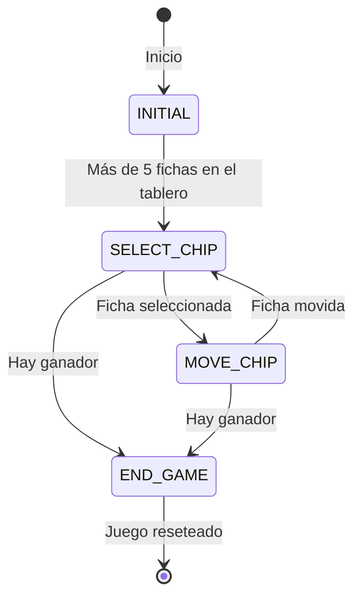

# 03.05 -  TicTacToe - Estados

## Lenguajes Estructurados

---

## Introducción

Diagrama de estados de un juego de TicTacToe.

---

## Estados

- INITIAL: En este estado, los jugadores están colocando sus fichas en el tablero. Cuando hay más de 5 fichas en el tablero, el juego pasa al estado SELECT_CHIP.
- SELECT_CHIP: En este estado, un jugador selecciona una de sus fichas para moverla. Si logra seleccionar una ficha, el juego pasa al estado MOVE_CHIP. Si durante este estado se encuentra un ganador, el juego pasa al estado END_GAME.
- MOVE_CHIP: En este estado, el jugador mueve la ficha que ha seleccionado. Una vez que se mueve la ficha, el juego regresa al estado SELECT_CHIP. Si durante este estado se encuentra un ganador, el juego pasa al estado END_GAME.
- END_GAME: Este es el estado final del juego. Una vez que el juego ha terminado, se puede resetear para volver al estado inicial.

