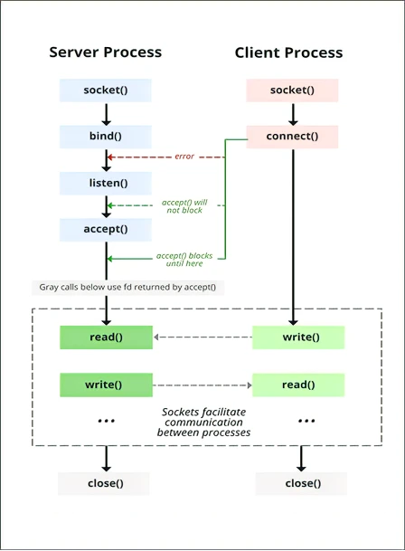
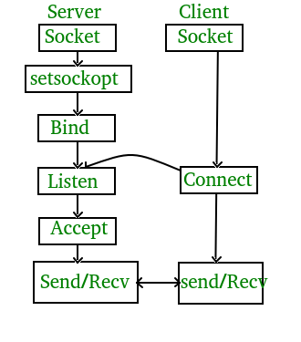

# TCP Server-Client en C

## Lenguajes Estructurados

---

## ¿Qué es la programación de sockets?

La programación de sockets es una forma de conectar dos nodos en una red para comunicarse entre sí.

Un socket (nodo) escucha en un puerto particular en una IP, mientras que el otro socket se extiende hacia el otro para formar una conexión.

El servidor forma el socket de escucha mientras el cliente se acerca al servidor.

---

### Diagrama de estado para el modelo de servidor y cliente



---

### Etapas para el servidor

### 1\. Creación de sockets

> int sockfd = socket(dominio, tipo, protocolo)

- **sockfd:** descriptor de socket, un entero (como un identificador de archivo)
- **dominio:** entero, especifica el dominio de comunicación. Utilizamos AF\_ LOCAL como se define en el estándar POSIX para la comunicación entre procesos en el mismo host. Para la comunicación entre procesos en diferentes hosts conectados por IPV4, utilizamos AF\_INET y AF\_I NET 6 para procesos conectados por IPV6.
- **tipo**: comunicación tipo SOCK\_STREAM: TCP (confiable, orientado a la conexión) SOCK\_DGRAM: UDP (no confiable, sin conexión)
- **protocolo:** Valor de protocolo para Protocolo de Internet (IP), que es 0. Este es el mismo número que aparece en el campo de protocolo en el encabezado IP de un paquete.

---

### 2\. Setsockopt

Esto ayuda a manipular las opciones para el socket referido por el descriptor de archivo sockfd. Esto es completamente opcional, pero ayuda en la reutilización de la dirección y el puerto. Evita errores como: "dirección ya en uso".

> int setsockopt(int sockfd, int level, int optname,  const void \*optval, socklen\_t optlen);

---

### 3\. Vincular

> int bind(int sockfd, const struct sockaddr \*addr, socklen\_t addrlen);

Después de la creación del socket, la función bind enlaza el socket a la dirección y al número de puerto especificados en addr (estructura de datos personalizada). En el código de ejemplo, vinculamos el servidor al localhost, por lo tanto, usamos INADDR\_ANY para especificar la dirección IP.

---

### 4\. Escuchar

> int listen(int sockfd, int backlog);

Pone el socket del servidor en modo pasivo, donde espera a que el cliente se acerque al servidor para realizar una conexión. El backlog, define la longitud máxima a la que puede crecer la cola de conexiones pendientes para sockfd. Si una solicitud de conexión llega cuando la cola está llena, el cliente puede recibir un error con una indicación de ECONNREFUSED.

---

### 5\. Aceptar

> int new\_socket= accept(int sockfd, struct sockaddr \*addr, socklen\_t \*addrlen);

Extrae la primera solicitud de conexión en la cola de conexiones pendientes para el socket de escucha, sockfd, crea un nuevo socket conectado y devuelve un nuevo descriptor de archivo que hace referencia a ese socket. En este punto, la conexión se establece entre el cliente y el servidor, y están listos para transferir datos.

---

## Etapas para el cliente

- **Conexión de socket:** Exactamente igual que el de la creación del socket del servidor
- **Conectar:** La llamada al sistema connect() conecta el socket al que hace referencia el descriptor de archivo sockfd a la dirección especificada por addr. La dirección y el puerto del servidor se especifican en addr.

> int connect(int sockfd, const struct sockaddr \*addr, socklen\_t addrlen);

---

## Implementación TCP Server-Client en C

El protocolo TCP utilizado por otros protocolos como HTTP, HTTPs, FTP, SMTP, Telnet.

TCP reorganiza los paquetes de datos en el orden especificado. Existe una garantía absoluta de que los datos transferidos permanecen intactos y llegan en el mismo orden en que fueron enviados.

TCP realiza el control de flujo y requiere tres paquetes para configurar una conexión de socket antes de que se puedan enviar datos de usuario.

TCP maneja la confiabilidad y el control de congestión. También realiza la comprobación de errores y la recuperación de errores. Los paquetes erróneos se retransmiten desde el origen al destino.

---

Todo el proceso se puede dividir en los siguientes pasos:



---

### Servidor TCP

1. create(): Crear socket TCP.
2. bind(): Enlazar el socket a la dirección del servidor.
3. listen(): dejar el socket del servidor en modo pasivo, donde espera a que el cliente se solicite al servidor establecer una conexión
4. accept(): en este punto, se establece la conexión entre el cliente y el servidor, y están listos para transferir datos.
5. volver al paso 3.

### Cliente TCP

1. Crear socket TCP.
2. Conectar el socket de cliente recién creado al servidor.

---

### Compilar y ejecutar

Lado del servidor:

```bash
gcc tcp_server.c -o tcp_server.exe -lws2_32
./server
```

Lado del cliente:  

```bash

 gcc tcp_client.c -o tcp_client.exe -lws2_32
 ```

### Salida

---

Lado del servidor:

```bash
Socket successfully created..
Socket successfully binded..
Server listening..
server accept the client...
From client: hi
     To client : hello
From client: exit
     To client : exit
Server Exit... 
```

Lado del cliente:

```bash
Socket successfully created..
connected to the server..
Enter the string : hi
From Server : hello
Enter the string : exit
From Server : exit
Client Exit... 
```

---

## Inicialización de Winsock para Windows

```c
WSADATA wsaData;
```

Esta línea declara una variable wsaData de tipo WSADATA.
La estructura WSADATA contiene información sobre la implementación de la biblioteca Winsock.
Se utiliza para almacenar detalles sobre la versión de Winsock en uso y otra información relevante.

```c
int iResult = WSAStartup(MAKEWORD(2, 2), &wsaData);
```

---

La función WSAStartup es la primera función que debe ser llamada antes de utilizar cualquier otra función de la biblioteca Winsock en un programa de Windows.

La función inicializa la biblioteca Winsock y proporciona información sobre la versión de Winsock disponible en el sistema. WSAStartup toma dos argumentos:

- El primer argumento, MAKEWORD(2, 2), especifica la versión de Winsock que el programa solicita. En este caso, estamos solicitando la versión 2.2 de Winsock. La macro MAKEWORD toma dos valores enteros (en este caso, 2 y 2) y los combina en un solo valor de tipo WORD. La función WSAStartup utiliza este valor para determinar si la versión de Winsock solicitada es compatible con la versión instalada en el sistema.

- El segundo argumento, &wsaData, es un puntero a la variable wsaData de tipo WSADATA declarada previamente. La función WSAStartup completa la estructura WSADATA con detalles sobre la implementación de Winsock en el sistema.

---

El valor de retorno de WSAStartup se almacena en la variable iResult. Si iResult es 0, significa que la función se ejecutó correctamente y la biblioteca Winsock se inicializó con éxito.
Si iResult es diferente de 0, hubo un error al inicializar Winsock.

```c
if (iResult != 0) {
    printf("WSAStartup failed with error: %d\n", iResult);
    return 1;
}
```

Esta parte del código verifica si iResult es diferente de 0, lo que indica un error al inicializar Winsock. Si hay un error, imprime un mensaje en la consola informando sobre el error y luego retorna 1, lo que termina la ejecución del programa.
Si iResult es 0, la función WSAStartup se ejecutó correctamente y el programa puede continuar utilizando la biblioteca Winsock.

---
